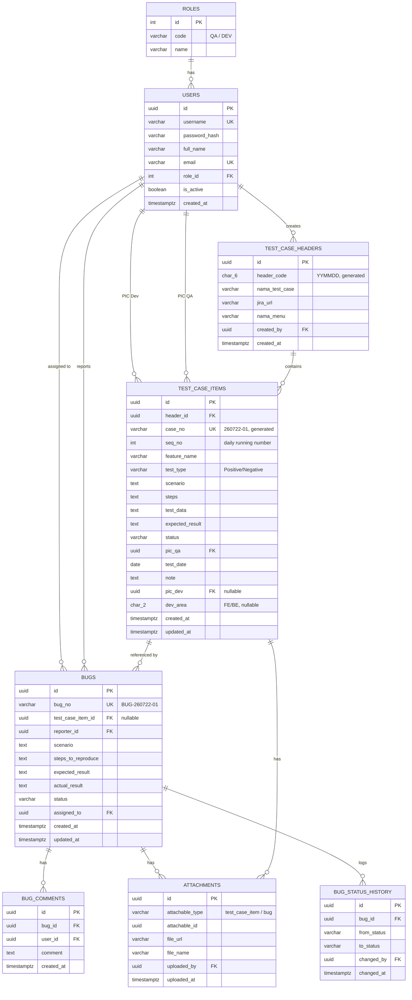
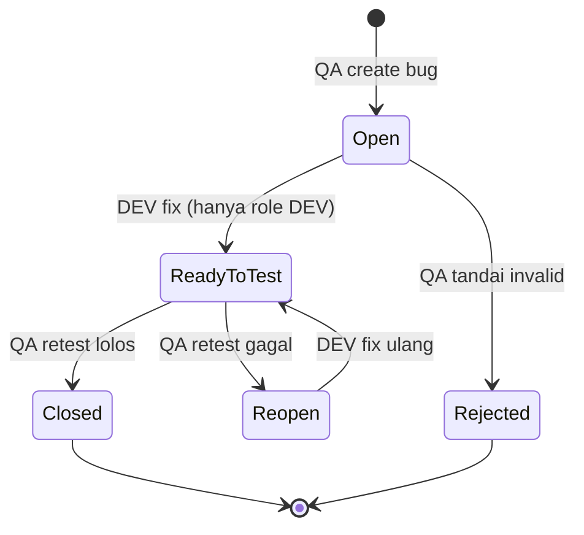

# Rancangan Sistem Test Case Management (TestRail-like)

Versi: 0.1 (Design Draft) — 22 Jul 2026
Stack: PostgreSQL, React + TypeScript untuk frontend.

---

## 1. Ringkasan & Asumsi Kunci

Berikut asumsi yang diambil karena requirement asli ambigu di beberapa titik. **Wajib dikonfirmasi ke stakeholder sebelum development.**

| # | Area | Ambiguitas Requirement | Asumsi yang Dipakai | Risiko jika Salah |
|---|------|------------------------|----------------------|--------------------|
| A1 | Penomoran Test Case | "ID Test case 6 digit + nomor test case" tidak jelas apakah nomor urut per *header* (batch create) atau global per hari lintas header | **Global per hari** — semua test case item yang dibuat di tanggal yang sama berbagi 1 counter (`260722-01`, `260722-02`, ...), meskipun berasal dari header/form create yang berbeda | Jika ternyata harus per-header, perlu migrasi counter (lihat §3.3, opsi alternatif disediakan) |
| A2 | Nomor Bug | Requirement hanya bilang "system generated", format tidak disebutkan | Format `BUG-YYMMDD-NN` (pola sama dengan test case, konsisten & mudah dibaca) | Ganti format cukup ubah 1 fungsi trigger, tidak breaking schema |
| A3 | "PIC Dev (FE atau BE)" | Bisa berarti (a) field kategori terpisah dari nama dev, atau (b) tipe dari user itu sendiri | Dipisah jadi 2 kolom: `pic_dev_id` (FK ke users, nullable) + `dev_area` (`FE`/`BE`, independen dari role user) — lebih fleksibel karena 1 developer bisa handle FE & BE tergantung ticket | - |
| A4 | Kategori Monitoring (Complete/On Progress/Hold) | Tidak dijelaskan aturan hitungnya | Dihitung dari agregasi status item test case per header/feature (lihat §2.4, view `v_test_case_monitoring`). "Hold" diprioritaskan jika ada item berstatus `On Hold` | Perlu konfirmasi apakah "Hold" ditentukan manual oleh QA Lead atau otomatis by system |
| A5 | Dokumentasi/upload | Diasumsikan bisa lebih dari 1 file per test case / bug | Tabel `attachments` generik (polymorphic: `attachable_type`, `attachable_id`) dipakai untuk test case & bug | Kalau cukup 1 file, bisa disederhanakan jadi kolom `documentation_url` |
| A6 | Status transisi Bug | Requirement hanya sebut Developer bisa ubah `Open -> Ready to Test` | State machine lengkap didefinisikan di §3.5 & §4.2, divalidasi di layer aplikasi + dicatat di `bug_status_history` untuk audit trail | State machine ini perlu direview oleh QA Lead & Dev Lead |

---

## 2. Entity Relationship Diagram (ERD)



Catatan struktur:
- `test_case_headers` = hasil dari Create Form (metadata: nama test case, jira url, nama menu). Ini adalah "batch/suite".
- `test_case_items` = baris-baris di tabel excel-like (Feature name, Scenario, Steps, dst). Satu header bisa punya banyak item.
- `case_no` (`260722-01`) di-generate otomatis, **bukan** disimpan sebagai string statis saja — dihasilkan dari trigger agar konsisten dan atomic (lihat §3.3).

**Import ke Navicat:** jalankan script DDL (§3) di database, lalu di Navicat gunakan menu *Tools > Reverse Engineer* (atau klik kanan database → *Reverse to Diagram*) untuk auto-generate ERD visual dari schema yang sudah dibuat. Ini lebih akurat daripada menggambar manual karena FK & constraint langsung terbaca.

---

## 3. PostgreSQL — DDL, Functions & Triggers

### 3.1 Master Tables

```sql
CREATE EXTENSION IF NOT EXISTS "pgcrypto"; -- untuk gen_random_uuid()

CREATE TABLE roles (
    id          SERIAL PRIMARY KEY,
    code        VARCHAR(10) NOT NULL UNIQUE,      -- 'QA' | 'DEV'
    name        VARCHAR(50) NOT NULL
);

INSERT INTO roles (code, name) VALUES ('QA','Quality Assurance'), ('DEV','Developer');

CREATE TABLE users (
    id            UUID PRIMARY KEY DEFAULT gen_random_uuid(),
    username      VARCHAR(50) NOT NULL UNIQUE,
    password_hash VARCHAR(255) NOT NULL,
    full_name     VARCHAR(150) NOT NULL,
    email         VARCHAR(150) NOT NULL UNIQUE,
    role_id       INT NOT NULL REFERENCES roles(id),
    is_active     BOOLEAN NOT NULL DEFAULT TRUE,
    created_at    TIMESTAMPTZ NOT NULL DEFAULT now(),
    updated_at    TIMESTAMPTZ NOT NULL DEFAULT now()
);

CREATE INDEX idx_users_role ON users(role_id);
```

### 3.2 Test Case Header

```sql
CREATE TABLE test_case_headers (
    id              UUID PRIMARY KEY DEFAULT gen_random_uuid(),
    header_code     CHAR(6) NOT NULL,           -- YYMMDD, di-generate trigger
    nama_test_case  VARCHAR(255) NOT NULL,
    jira_url        VARCHAR(500),
    nama_menu       VARCHAR(255) NOT NULL,
    created_by      UUID NOT NULL REFERENCES users(id),
    created_at      TIMESTAMPTZ NOT NULL DEFAULT now(),
    updated_at      TIMESTAMPTZ NOT NULL DEFAULT now()
);

CREATE OR REPLACE FUNCTION fn_set_header_code()
RETURNS TRIGGER AS $$
BEGIN
    NEW.header_code := to_char(now(), 'YYMMDD');
    RETURN NEW;
END;
$$ LANGUAGE plpgsql;

CREATE TRIGGER trg_set_header_code
BEFORE INSERT ON test_case_headers
FOR EACH ROW EXECUTE FUNCTION fn_set_header_code();
```

### 3.3 Test Case Items — Auto Numbering (Race-Condition Safe)

Pendekatan naif `SELECT MAX(seq_no)+1` **tidak aman** untuk concurrent insert (dua QA submit bersamaan bisa dapat nomor sama). Solusi: counter table + atomic `UPDATE ... RETURNING`.

```sql
-- Counter global harian, terpisah dari header (lihat asumsi A1)
CREATE TABLE test_case_daily_counter (
    counter_date DATE PRIMARY KEY,
    last_seq     INT NOT NULL DEFAULT 0
);

CREATE TABLE test_case_items (
    id               UUID PRIMARY KEY DEFAULT gen_random_uuid(),
    header_id        UUID NOT NULL REFERENCES test_case_headers(id) ON DELETE CASCADE,
    case_no          VARCHAR(9) UNIQUE,            -- '260722-01'
    seq_no           INT NOT NULL,
    feature_name     VARCHAR(255) NOT NULL,
    test_type        VARCHAR(10) NOT NULL CHECK (test_type IN ('Positive','Negative')),
    scenario         TEXT NOT NULL,
    steps            TEXT NOT NULL,
    test_data        TEXT,
    expected_result  TEXT NOT NULL,
    status           VARCHAR(20) NOT NULL DEFAULT 'Not Executed'
                       CHECK (status IN ('Not Executed','Pass','Fail','Blocked','On Hold')),
    pic_qa           UUID NOT NULL REFERENCES users(id),
    test_date        DATE,
    note             TEXT,
    pic_dev          UUID REFERENCES users(id),
    dev_area         CHAR(2) CHECK (dev_area IN ('FE','BE')),
    created_at       TIMESTAMPTZ NOT NULL DEFAULT now(),
    updated_at       TIMESTAMPTZ NOT NULL DEFAULT now()
);

CREATE INDEX idx_tci_header ON test_case_items(header_id);
CREATE INDEX idx_tci_status ON test_case_items(status);
CREATE INDEX idx_tci_pic_qa ON test_case_items(pic_qa);

CREATE OR REPLACE FUNCTION fn_before_insert_test_case_item()
RETURNS TRIGGER AS $$
DECLARE
    v_seq    INT;
    v_header CHAR(6);
BEGIN
    -- Atomic upsert counter harian (row lock otomatis dari UPDATE, aman untuk concurrency)
    INSERT INTO test_case_daily_counter (counter_date, last_seq)
    VALUES (CURRENT_DATE, 1)
    ON CONFLICT (counter_date)
    DO UPDATE SET last_seq = test_case_daily_counter.last_seq + 1
    RETURNING last_seq INTO v_seq;

    SELECT header_code INTO v_header FROM test_case_headers WHERE id = NEW.header_id;

    NEW.seq_no  := v_seq;
    NEW.case_no := v_header || '-' || lpad(v_seq::text, 2, '0');
    NEW.updated_at := now();
    RETURN NEW;
END;
$$ LANGUAGE plpgsql;

CREATE TRIGGER trg_test_case_item_seq
BEFORE INSERT ON test_case_items
FOR EACH ROW EXECUTE FUNCTION fn_before_insert_test_case_item();
```

**Edge case penting:** `lpad(..,2,'0')` mentok di 99 test case/hari (`260722-99`). Kalau volume QA tim > 99 case/hari itu realistis, ganti ke `lpad(v_seq::text, 3, '0')` dari awal — jangan tunggu overflow di production karena `case_no` bertipe `VARCHAR(9)` dan format berubah akan mem-break parsing di frontend.

**Alternatif (jika ternyata numbering harus per-header, bukan global):** tambah kolom `last_seq` di `test_case_headers`, ganti logic trigger jadi:
```sql
UPDATE test_case_headers SET last_seq = last_seq + 1
WHERE id = NEW.header_id
RETURNING last_seq, header_code INTO v_seq, v_header;
```
Ini juga atomic (row lock pada header), tapi artinya `260722-01` bisa muncul dobel jika 2 header dibuat di hari yang sama — perlu di-review dengan requirement asli.

### 3.4 Bugs, Comments, Status History

```sql
CREATE TABLE bug_daily_counter (
    counter_date DATE PRIMARY KEY,
    last_seq     INT NOT NULL DEFAULT 0
);

CREATE TABLE bugs (
    id                  UUID PRIMARY KEY DEFAULT gen_random_uuid(),
    bug_no              VARCHAR(14) UNIQUE,        -- 'BUG-260722-01'
    test_case_item_id   UUID REFERENCES test_case_items(id),
    reporter_id         UUID NOT NULL REFERENCES users(id),
    scenario            TEXT NOT NULL,
    steps_to_reproduce  TEXT NOT NULL,
    expected_result     TEXT NOT NULL,
    actual_result       TEXT NOT NULL,
    status              VARCHAR(20) NOT NULL DEFAULT 'Open'
                          CHECK (status IN ('Open','Ready to Test','Reopen','Closed','Rejected')),
    assigned_to         UUID REFERENCES users(id),
    created_at          TIMESTAMPTZ NOT NULL DEFAULT now(),
    updated_at          TIMESTAMPTZ NOT NULL DEFAULT now()
);

CREATE INDEX idx_bugs_status ON bugs(status);
CREATE INDEX idx_bugs_assigned ON bugs(assigned_to);
CREATE INDEX idx_bugs_test_case ON bugs(test_case_item_id);

CREATE OR REPLACE FUNCTION fn_before_insert_bug()
RETURNS TRIGGER AS $$
DECLARE
    v_seq INT;
BEGIN
    INSERT INTO bug_daily_counter (counter_date, last_seq)
    VALUES (CURRENT_DATE, 1)
    ON CONFLICT (counter_date)
    DO UPDATE SET last_seq = bug_daily_counter.last_seq + 1
    RETURNING last_seq INTO v_seq;

    NEW.bug_no := 'BUG-' || to_char(now(),'YYMMDD') || '-' || lpad(v_seq::text,2,'0');
    RETURN NEW;
END;
$$ LANGUAGE plpgsql;

CREATE TRIGGER trg_bug_no
BEFORE INSERT ON bugs
FOR EACH ROW EXECUTE FUNCTION fn_before_insert_bug();

CREATE TABLE bug_comments (
    id          UUID PRIMARY KEY DEFAULT gen_random_uuid(),
    bug_id      UUID NOT NULL REFERENCES bugs(id) ON DELETE CASCADE,
    user_id     UUID NOT NULL REFERENCES users(id),
    comment     TEXT NOT NULL,
    created_at  TIMESTAMPTZ NOT NULL DEFAULT now()
);

CREATE TABLE bug_status_history (
    id           UUID PRIMARY KEY DEFAULT gen_random_uuid(),
    bug_id       UUID NOT NULL REFERENCES bugs(id) ON DELETE CASCADE,
    from_status  VARCHAR(20),
    to_status    VARCHAR(20) NOT NULL,
    changed_by   UUID NOT NULL REFERENCES users(id),
    changed_at   TIMESTAMPTZ NOT NULL DEFAULT now()
);

-- Trigger audit: catat setiap perubahan status bug otomatis
CREATE OR REPLACE FUNCTION fn_log_bug_status_change()
RETURNS TRIGGER AS $$
BEGIN
    IF (TG_OP = 'UPDATE' AND NEW.status IS DISTINCT FROM OLD.status) THEN
        INSERT INTO bug_status_history (bug_id, from_status, to_status, changed_by)
        VALUES (NEW.id, OLD.status, NEW.status, NEW.updated_by); -- updated_by di-set app layer via SET LOCAL / session var, lihat catatan di bawah
    END IF;
    NEW.updated_at := now();
    RETURN NEW;
END;
$$ LANGUAGE plpgsql;

CREATE TRIGGER trg_bug_status_log
BEFORE UPDATE ON bugs
FOR EACH ROW EXECUTE FUNCTION fn_log_bug_status_change();
```

> Catatan implementasi: kolom `updated_by` tidak ada di tabel `bugs` di atas — dua opsi: (1) tambah kolom `updated_by UUID` di `bugs` dan set dari aplikasi sebelum UPDATE, atau (2) pakai `current_setting('app.current_user_id')` yang di-set via `SET LOCAL` di awal transaksi dari backend PHP. Opsi (1) lebih simpel untuk tim yang belum terbiasa session variable Postgres — rekomendasi pakai itu dulu.

### 3.5 Validasi Transisi Status Bug (Defense in Depth)

Business rule: Developer **hanya boleh** `Open -> Ready to Test`. QA yang punya kontrol penuh atas transisi lain. Enforce di layer aplikasi (PHP service) **dan** di DB sebagai safety net:

```sql
CREATE TABLE bug_status_transitions (
    from_status  VARCHAR(20) NOT NULL,
    to_status    VARCHAR(20) NOT NULL,
    allowed_role VARCHAR(10) NOT NULL,   -- 'QA' | 'DEV' | 'ANY'
    PRIMARY KEY (from_status, to_status, allowed_role)
);

INSERT INTO bug_status_transitions (from_status, to_status, allowed_role) VALUES
    ('Open', 'Ready to Test', 'DEV'),
    ('Ready to Test', 'Reopen', 'QA'),
    ('Ready to Test', 'Closed', 'QA'),
    ('Reopen', 'Ready to Test', 'DEV'),
    ('Open', 'Rejected', 'QA');
```
Backend wajib cek tabel ini sebelum `UPDATE bugs SET status = ...`. Jangan hanya andalkan `CHECK` constraint di kolom `status`, karena `CHECK` tidak tahu siapa yang melakukan perubahan (role-aware validation harus di service layer / trigger dengan session variable role).

### 3.6 Attachments (Generik untuk Test Case & Bug)

```sql
CREATE TABLE attachments (
    id               UUID PRIMARY KEY DEFAULT gen_random_uuid(),
    attachable_type  VARCHAR(20) NOT NULL CHECK (attachable_type IN ('test_case_item','bug')),
    attachable_id    UUID NOT NULL,
    file_url         VARCHAR(500) NOT NULL,
    file_name        VARCHAR(255) NOT NULL,
    uploaded_by      UUID NOT NULL REFERENCES users(id),
    uploaded_at      TIMESTAMPTZ NOT NULL DEFAULT now()
);

CREATE INDEX idx_attachments_owner ON attachments(attachable_type, attachable_id);
```
Tidak pakai FK langsung ke dua tabel berbeda (polymorphic association) — trade-off: kehilangan referential integrity native Postgres. Kalau tim lebih suka integrity ketat, pecah jadi 2 tabel terpisah (`test_case_attachments`, `bug_attachments`) masing-masing dengan FK asli.

### 3.7 Monitoring Views

```sql
-- Monitoring Test Case: persentase & kategori per header/feature
CREATE OR REPLACE VIEW v_test_case_monitoring AS
SELECT
    h.id                                            AS header_id,
    h.header_code,
    h.nama_test_case,
    COUNT(i.id)                                     AS total_case,
    COUNT(i.id) FILTER (WHERE i.status IN ('Pass','Fail','Blocked')) AS executed_case,
    ROUND(
        100.0 * COUNT(i.id) FILTER (WHERE i.status IN ('Pass','Fail','Blocked'))
        / NULLIF(COUNT(i.id), 0), 2
    )                                                AS percentage,
    CASE
        WHEN COUNT(i.id) FILTER (WHERE i.status = 'On Hold') > 0 THEN 'Hold'
        WHEN COUNT(i.id) FILTER (WHERE i.status IN ('Pass','Fail','Blocked')) = COUNT(i.id)
             AND COUNT(i.id) > 0 THEN 'Complete'
        ELSE 'On Progress'
    END                                              AS category,
    string_agg(DISTINCT u.full_name, ', ')           AS pic_qa
FROM test_case_headers h
JOIN test_case_items i ON i.header_id = h.id
JOIN users u ON u.id = i.pic_qa
GROUP BY h.id, h.header_code, h.nama_test_case;

-- Monitoring Bug: rekap per status & assignee
CREATE OR REPLACE VIEW v_bug_monitoring AS
SELECT
    b.status,
    dev.full_name  AS assigned_to_name,
    COUNT(*)       AS total_bug,
    COUNT(*) FILTER (WHERE b.created_at::date = CURRENT_DATE) AS created_today
FROM bugs b
LEFT JOIN users dev ON dev.id = b.assigned_to
GROUP BY b.status, dev.full_name;
```

Query untuk tabel `ID Test Case | Nama Test Case | Persentase | PIC QA` di menu Monitoring tinggal `SELECT header_code, nama_test_case, percentage, pic_qa, category FROM v_test_case_monitoring WHERE category = :filter;`

---

## 4. REST API Design

Auth: JWT (access token short-lived ~15 menit + refresh token httpOnly cookie). Middleware role-based guard di setiap route.

### 4.1 Endpoint Summary

| Method | Endpoint | Role | Deskripsi |
|---|---|---|---|
| POST | `/api/auth/login` | Public | Login, return JWT + refresh token |
| POST | `/api/auth/refresh` | Public (refresh token) | Refresh access token |
| POST | `/api/auth/logout` | Authenticated | Invalidate refresh token |
| POST | `/api/test-case-headers` | QA | Create header (Create Form) |
| GET | `/api/test-case-headers` | QA, DEV | List header |
| POST | `/api/test-case-headers/:id/items` | QA | Tambah baris test case (grid) |
| PUT | `/api/test-case-items/:id` | QA | Update baris test case |
| DELETE | `/api/test-case-items/:id` | QA | Delete baris test case |
| GET | `/api/test-case-items` | QA, DEV | List semua item (read-only utk DEV) |
| POST | `/api/bugs` | QA | Create bug report |
| GET | `/api/bugs` | QA, DEV | List bug |
| GET | `/api/bugs/:id` | QA, DEV | Detail bug + comments + history |
| PATCH | `/api/bugs/:id/status` | QA (semua transisi), DEV (hanya Open→Ready to Test) | Update status, validasi via `bug_status_transitions` |
| POST | `/api/bugs/:id/comments` | QA, DEV | Tambah komentar |
| POST | `/api/bugs/:id/attachments` | QA | Upload dokumen bug |
| GET | `/api/monitoring/test-cases` | QA, DEV | Data `v_test_case_monitoring`, filter kategori |
| GET | `/api/monitoring/bugs` | QA, DEV | Data `v_bug_monitoring` |

### 4.2 Bug Status State Machine



### 4.3 RBAC Matrix

| Fitur / Aksi | QA | Developer |
|---|---|---|
| Login | ✅ | ✅ |
| Create/Update/Delete Test Case | ✅ | ❌ (read-only) |
| View Test Case List | ✅ | ✅ |
| Create Bug | ✅ | ❌ |
| View Bug List / Detail | ✅ | ✅ |
| Comment di Bug | ✅ | ✅ |
| Ubah status bug: `Open → Ready to Test` | ❌ (bukan aksi dia) | ✅ |
| Ubah status bug: transisi lain (`Reopen`, `Closed`, `Rejected`) | ✅ | ❌ |
| Assign bug ke Developer | ✅ | ❌ |
| View Monitoring Test Case & Bug | ✅ | ✅ |
| Upload dokumentasi test case/bug | ✅ | ❌ (kecuali eksplisit dibutuhkan saat komentar — perlu konfirmasi) |

Catatan keamanan: validasi role **tidak boleh** hanya di frontend (hide button). Middleware backend wajib cek JWT claim `role` di setiap endpoint, terutama `PATCH /bugs/:id/status` — inilah titik paling rawan privilege escalation kalau hanya divalidasi di React.

---

## 5. Frontend Architecture (React + TypeScript)

### 5.1 Folder Structure

```
src/
├── app/
│   ├── App.tsx
│   ├── routes.tsx              # route config + role guard mapping
│   └── providers/              # AuthProvider, QueryClientProvider
├── api/
│   ├── axiosClient.ts          # instance + interceptor JWT refresh
│   ├── testCaseApi.ts
│   ├── bugApi.ts
│   └── monitoringApi.ts
├── auth/
│   ├── AuthContext.tsx
│   ├── useAuth.ts
│   ├── PrivateRoute.tsx
│   └── RoleGuard.tsx           # <RoleGuard allow={['QA']}>...</RoleGuard>
├── features/
│   ├── auth/
│   │   └── LoginPage.tsx
│   ├── test-cases/
│   │   ├── TestCaseListPage.tsx
│   │   ├── TestCaseCreateForm.tsx
│   │   ├── TestCaseGrid.tsx        # editable grid (ag-Grid)
│   │   ├── useTestCases.ts         # react-query hooks
│   │   └── testCase.types.ts
│   ├── bugs/
│   │   ├── BugListPage.tsx
│   │   ├── BugCreateForm.tsx
│   │   ├── BugDetailDrawer.tsx     # comments + status change + history
│   │   ├── useBugs.ts
│   │   └── bug.types.ts
│   └── monitoring/
│       ├── MonitoringDashboardPage.tsx
│       ├── TestCaseMonitoringTable.tsx
│       └── BugMonitoringTable.tsx
├── components/
│   ├── ui/                     # StatusBadge, ConfirmDialog, FileUpload
│   └── layout/                 # Sidebar (menu by role), Topbar
├── types/
│   └── entities.ts             # shared TS interfaces (mirror DB schema)
└── utils/
```

### 5.2 TypeScript Interfaces (mirror schema)

```typescript
// types/entities.ts
export type Role = 'QA' | 'DEV';

export interface User {
  id: string;
  username: string;
  fullName: string;
  email: string;
  role: Role;
}

export interface TestCaseHeader {
  id: string;
  headerCode: string;       // '260722'
  namaTestCase: string;
  jiraUrl: string;
  namaMenu: string;
  createdBy: string;
  createdAt: string;
}

export type TestType = 'Positive' | 'Negative';
export type TestCaseStatus = 'Not Executed' | 'Pass' | 'Fail' | 'Blocked' | 'On Hold';

export interface TestCaseItem {
  id: string;
  headerId: string;
  caseNo: string;            // '260722-01'
  featureName: string;
  testType: TestType;
  scenario: string;
  steps: string;
  testData?: string;
  expectedResult: string;
  status: TestCaseStatus;
  picQa: string;              // user id
  testDate?: string;
  note?: string;
  picDev?: string;
  devArea?: 'FE' | 'BE';
}

export type BugStatus = 'Open' | 'Ready to Test' | 'Reopen' | 'Closed' | 'Rejected';

export interface Bug {
  id: string;
  bugNo: string;              // 'BUG-260722-01'
  testCaseItemId?: string;
  reporterId: string;
  scenario: string;
  stepsToReproduce: string;
  expectedResult: string;
  actualResult: string;
  status: BugStatus;
  assignedTo?: string;
  attachments: Attachment[];
}

export interface BugComment {
  id: string;
  bugId: string;
  userId: string;
  comment: string;
  createdAt: string;
}

export interface Attachment {
  id: string;
  fileUrl: string;
  fileName: string;
}

export interface TestCaseMonitoring {
  headerId: string;
  headerCode: string;
  namaTestCase: string;
  percentage: number;
  category: 'Complete' | 'On Progress' | 'Hold';
  picQa: string;
}
```

### 5.3 Editable "Excel-like" Grid

Rekomendasi: **ag-Grid Community (`ag-grid-react`)** — sudah punya cell editing, copy-paste antar cell, keyboard navigation, dan column pinning out-of-the-box, jadi tidak perlu bikin ulang UX Excel dari nol. Alternatif lebih ringan: TanStack Table v8 + custom editable cell (lebih banyak kerja manual, tapi bundle size lebih kecil).

```typescript
// features/test-cases/TestCaseGrid.tsx
import { AgGridReact } from 'ag-grid-react';
import type { ColDef } from 'ag-grid-community';
import { TestCaseItem } from '../../types/entities';

const columnDefs: ColDef<TestCaseItem>[] = [
  { field: 'caseNo', headerName: 'No', editable: false, pinned: 'left', width: 110 },
  { field: 'featureName', headerName: 'Feature Name', editable: true },
  {
    field: 'testType',
    headerName: 'Test Type',
    editable: true,
    cellEditor: 'agSelectCellEditor',
    cellEditorParams: { values: ['Positive', 'Negative'] },
  },
  { field: 'scenario', headerName: 'Scenario', editable: true, flex: 2 },
  { field: 'steps', headerName: 'Steps', editable: true, flex: 2 },
  { field: 'testData', headerName: 'Data Test', editable: true },
  { field: 'expectedResult', headerName: 'Expected Result', editable: true, flex: 2 },
  {
    field: 'status',
    headerName: 'Status',
    editable: true,
    cellEditor: 'agSelectCellEditor',
    cellEditorParams: { values: ['Not Executed', 'Pass', 'Fail', 'Blocked', 'On Hold'] },
  },
  { field: 'picQa', headerName: 'PIC QA', editable: true },
  { field: 'testDate', headerName: 'Test Date', editable: true },
  { field: 'note', headerName: 'Note', editable: true },
  { field: 'picDev', headerName: 'PIC Dev', editable: true },
];

export function TestCaseGrid({ rows, onCellChanged, readOnly }: {
  rows: TestCaseItem[];
  onCellChanged: (row: TestCaseItem) => void;
  readOnly: boolean;
}) {
  return (
    <div className="ag-theme-alpine" style={{ height: 600, width: '100%' }}>
      <AgGridReact<TestCaseItem>
        rowData={rows}
        columnDefs={columnDefs.map(c => ({ ...c, editable: readOnly ? false : c.editable }))}
        onCellValueChanged={(e) => onCellChanged(e.data)}
        stopEditingWhenCellsLoseFocus
      />
    </div>
  );
}
```

`readOnly` di-drive dari role user login (`useAuth().user.role !== 'QA'`) — Developer buka grid yang sama tapi semua kolom non-editable.

### 5.4 Role Guard Contoh

```typescript
// auth/RoleGuard.tsx
import { useAuth } from './useAuth';
import { Role } from '../types/entities';

export function RoleGuard({ allow, children }: { allow: Role[]; children: React.ReactNode }) {
  const { user } = useAuth();
  if (!user || !allow.includes(user.role)) return null;
  return <>{children}</>;
}

// pemakaian di BugDetailDrawer.tsx
<RoleGuard allow={['DEV']}>
  <button onClick={() => changeStatus('Ready to Test')}>Mark as Ready to Test</button>
</RoleGuard>
<RoleGuard allow={['QA']}>
  <StatusDropdown options={['Reopen', 'Closed', 'Rejected']} onChange={changeStatus} />
</RoleGuard>
```

Ingat: ini **hanya UX**, validasi sesungguhnya tetap di backend (§4.3).

---

## 6. Ringkasan Menu vs Komponen

| Menu | Halaman React | Endpoint Utama | Akses |
|---|---|---|---|
| Login | `LoginPage` | `POST /auth/login` | Semua |
| CRUD Test Case | `TestCaseListPage`, `TestCaseCreateForm`, `TestCaseGrid` | `/test-case-headers`, `/test-case-items` | QA full, DEV read-only |
| List Bug | `BugListPage`, `BugCreateForm`, `BugDetailDrawer` | `/bugs`, `/bugs/:id/comments`, `/bugs/:id/status` | QA full, DEV terbatas |
| Monitoring | `MonitoringDashboardPage` | `/monitoring/test-cases`, `/monitoring/bugs` | QA & DEV (read-only) |

---

## 7. Next Steps (Rekomendasi)

1. Konfirmasi 6 asumsi di §1 ke Product Owner / QA Lead sebelum mulai coding.
2. Finalisasi state machine bug (§4.2) — apakah perlu status tambahan seperti `In Progress` (dev sedang kerjakan sebelum Ready to Test)?
3. Tentukan storage attachment: local disk, S3-compatible (MinIO), atau langsung link Google Drive/Jira.
4. Setup Postman collection untuk setiap endpoint di §4.1 (bisa saya buatkan terpisah jika perlu, termasuk test script untuk validasi JWT & role).
5. Definisikan test scenario (positive/negative, BVA) untuk fitur numbering otomatis (§3.3) — ini area paling rawan bug karena concurrency.
